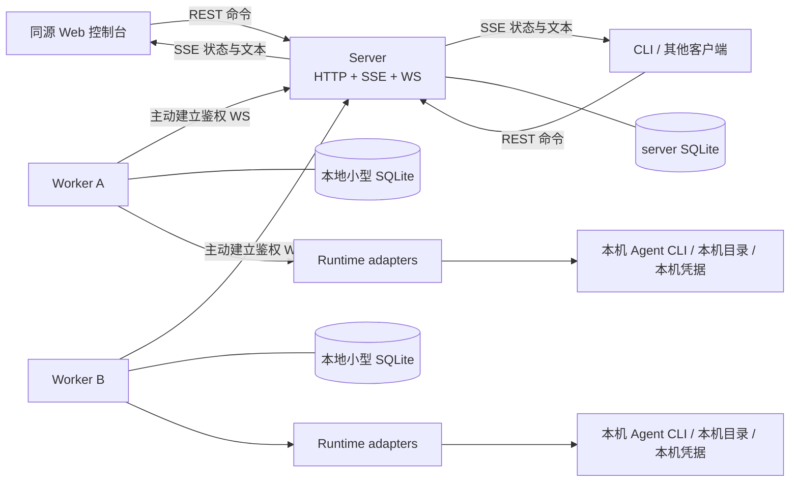

# wemux-slim 能力调研与 wemux-lite 最小化方案

> 状态：调研与设计建议，尚未实施，也未由用户确认技术栈和首批 runtime。
> 参考代码：`/opt/data/profiles/scribe/workspace/wemux-slim`，commit `9aba1e64a9718abf9e30cb3da062d65c82b0677b`，根 package version `0.3.131`。
> 目标目录：`/opt/data/profiles/scribe/workspace/wemux-lite`；调研开始时为空目录，无现有代码和依赖。
> 方法：只读源码、清单、测试与官方协议文档；没有安装依赖、运行参考项目、探测真实账号或执行模型请求。下文明确区分源码事实和新项目建议。

## 1. 结论

**建议重新做一个“远程智能体会话管理器”，而不是复制完整 Wemux 后逐层删减。**

目标闭环只有：

```text
worker 注册 → 上报本机 runtime 和模型能力
             ↓
项目绑定多个 worker 的本地目录
             ↓
客户端选项目 / worker / runtime / model → 创建 session
             ↓
发消息 → worker 运行智能体 → 流式展示 → 继续对话 / 取消 / 审批
```

推荐部署形态：**一个 server 进程 + 每台执行机器一个 worker 进程 + SQLite 文件**。不引入 PostgreSQL、Redis、消息队列、对象存储、容器编排。Agent CLI 和模型服务是执行依赖，不是额外控制面中间件，仍需要用户自行安装、登录或配置。

第一版明确不提供：任务看板、群聊、组织权限、模型网关、计费、自动 Git worktree、仓库同步、远程终端、文件上传、历史终端接管、跨 worker 会话迁移。安全和执行状态核对不能因为“最小化”而省略。

## 2. 参考项目的能力与复杂度

### 2.1 定位和依赖：源码事实

参考项目是完整的 Agent 协作平台，包含 Web、server、worker、桌面端、移动端及 shared 契约。README 宣称的核心链路包括主聊天编排、任务与工作区、隔离 worktree、审批以及多个外部聊天渠道。

- 产品能力说明：`wemux-slim/README.zh-CN.md:34-43`、`:70-98`。
- 根依赖清单：`wemux-slim/package.json:99-200`。按根清单统计，运行 dependencies **73 项**，devDependencies **24 项**；这不是传递依赖数量，也不是每个进程实际加载数量。
- 已有依赖包括 Hono、`ws`、Postgres/Drizzle、Better Auth、React/TanStack、`node-pty`、MCP/ACP SDK、OpenCode SDK 与 Pi runtime 包。
- PostgreSQL 是主存储；对象上传使用 S3 兼容存储。README 特别说明对象存储配置是“上传功能必填”，不能推断普通对话必然依赖 S3：`wemux-slim/README.zh-CN.md:98`、`:150-157`。
- 本地基础设施 compose 配置 PostgreSQL 和 RustFS：`wemux-slim/deploy/docker/docker-compose.infra.yml`。
- 在根依赖、server 源码与部署配置的本轮检索范围内，没有发现 Redis/BullMQ 依赖；**不能把 Redis 描述成参考项目原有的必需中间件**。

### 2.2 最值得继承的设计

| 设计 | 对 mini 的价值 | 不应连带引入的东西 |
|---|---|---|
| server 是控制面，worker 执行本地代码 | NAT 后 worker 可管理；server 无需本地仓库与模型凭据 | server 本地执行后备路径 |
| 共享通信契约 | Web、其他客户端、server、worker 对状态理解一致 | 把整个 shared 类型库搬过来 |
| 一个项目关联多个执行节点 | 统一归组不同机器上的 session | 任务、工作区、分布式任务全套层级 |
| runtime adapter | 把原生会话 ID、事件和协议差异集中在 worker | 一个庞大的万能 agent 框架 |
| 流式事件、取消、权限处理 | 不只是一次性 prompt/response | 默认无条件授权 |

参考表结构已有 `projectBindings(projectId, nodeId, repoUrl, defaultBranch, pathHint)`，复合主键是项目与节点；但工作区、worktree 和任务又引入额外层级：`wemux-slim/apps/server/src/storage/postgres/schema-core.ts:824-871`、`:898-938`。mini 只需借鉴“全局项目 + 节点本地绑定”，不要照搬这些执行层级。

### 2.3 一处必须区别文档宣称与实际实现的地方

README 写着 BYOK 密钥永不离开 worker：`wemux-slim/README.zh-CN.md:175-177`。但源码存在携带解析后凭据的导出链路：

- worker 导出包含可选 `apiToken` 的模型绑定：`wemux-slim/apps/worker/src/runtime/model-config-export.ts:347-423`。
- server 主动请求 `includeResolvedModelBindings: true` 并映射 `apiToken`：`wemux-slim/apps/server/src/services/model-profile-service.ts:279-296`。
- 工作区执行链路也请求此选项：`wemux-slim/apps/server/src/services/task-chat-dispatch/workspace-executor.ts:224`。

这说明源码存在 worker → server 传递凭据的路径，不能仅依据 README 承诺绝对不传。**这不是本轮运行观察，也不代表所有请求都会导出凭据。** mini 应从通信字段层面禁止上传 token、完整环境变量和 credential 文件；仅传模型元数据。

### 2.4 真实执行链路：可以绕开任务系统

```text
Web POST /api/ai/chat-stream
  → server streamMainChatResponse
  → requestAgentPrompt(executorId, requestId, cwd, resumeSessionId, model)
  → worker prompt queue → runWorkerAgentPrompt → runtime adapter
  ← executor.agent.prompt.event / response
  ← server 持久化 + SSE；另有 session WS 订阅
```

源码入口：

- Web：`wemux-slim/apps/web/src/lib/api/methods/chat.ts:60-62`。
- HTTP/SSE：`wemux-slim/apps/server/src/routes/project-routes.ts:1404-1462`。
- 主聊天派发：`wemux-slim/apps/server/src/routes/project-main-chat.ts:968-1000`。
- RPC：`wemux-slim/apps/server/src/control-plane/executor-ws-requests.ts:1135-1310`。
- worker 执行队列：`wemux-slim/apps/worker/src/runtime/message-handler/prompt-queue.ts:55-165`。
- runtime 分发：`wemux-slim/apps/worker/src/execution/agent-runner.ts:77-204`。
- server 回传处理：`wemux-slim/apps/server/src/control-plane/executor-ws-message-handler.ts:1345-1407`。

普通对话可以直接走 prompt RPC，不必先创建 DistributedTask；工作区也有调用该 RPC 的路径。参考项目的 MainChatSession 不是已经满足本需求的统一项目 session：其定义包含 executor/cwd/runtimeContinuations，但没有直接的 projectId，见 `wemux-slim/packages/shared/src/types/task-domain.ts:786-829`。

### 2.5 注册、心跳与恢复的实际边界

| 项目 | 源码事实 | mini 取舍 |
|---|---|---|
| 配对 | 已登录用户创建配对码，worker HTTP 兑换 executorId/token，再建立 WS | 可简化成管理员预置每 worker 独立 token |
| 身份 | server 根据握手凭据确定 executorId，并核对返回请求的归属 | 保留；不能信任消息体自报身份 |
| 心跳 | worker 15 秒一次，server stale 阈值 45 秒 | 可借鉴，参数配置化 |
| 重连 | 断线后固定等待 5 秒；prompt 在 error/close 时主动 abort | mini 必须重新定义断线语义，不能宣称复制后即可断点续跑 |
| 出站缓冲 | 内存可靠消息队列最多 1000 条，满时有淘汰；不是持久 ACK outbox | 不照搬为“可靠执行保证” |
| 注册目录 | 主要上报执行能力、项目绑定、任务、终端；不是完整 runtime/version/auth/model inventory | mini 新增明确的智能体目录契约 |

证据：`wemux-slim/apps/server/src/routes/executor-control-plane-routes.ts:232-291`、`wemux-slim/apps/server/src/routes/executor-ws-route.ts:169-203`、`wemux-slim/apps/server/src/control-plane/executor-registry.ts:61-67`、`wemux-slim/apps/worker/src/runtime/daemon.ts:671-791`、`:895-918`、`:1000-1035`。

另外，当前 worker WS 客户端把 token 放在 URL，错误消息可能带该 URL：`wemux-slim/apps/worker/src/control-plane/ws-client.ts:29-30`、`:54`。mini 应使用 Authorization header，避免凭据进入 URL 日志。

### 2.6 四种真实 runtime 与模型来源

| Runtime | 执行协议 | 参考项目模型来源 | 不可误读的地方 |
|---|---|---|---|
| OpenCode | 本地 `opencode serve` + SDK HTTP/event | 本地服务 `config.providers()` | 枚举可能启动服务，不是纯文件扫描 |
| Codex | app-server/proto 子进程，stdio JSON-RPC | provider HTTP `/models`，失败退回默认模型/空列表 | 参考代码没有采用下面新方案建议的原生 `model/list` |
| Claude Code | `claude -p`，双向 stream-json/control | shared 静态模型数组 | 不证明账号有权限使用每个模型 |
| Pi | 进程内 `@mariozechner/pi-coding-agent` SDK | AuthStorage + ModelRegistry.getAvailable | 检测的是 SDK 可加载，不是本机 Pi CLI 已登录 |

证据：

- 四种 runtime：`wemux-slim/packages/shared/src/agent-type.ts:6-67`。
- OpenCode：`wemux-slim/apps/worker/src/execution/opencode/client.ts:119-133`、`:251-258`；`wemux-slim/apps/worker/src/execution/opencode/models.ts:96-129`。
- Codex：`wemux-slim/apps/worker/src/execution/codex-runner.ts:21-47`、`:1327-1353`、`:1987-2066`；`wemux-slim/apps/worker/src/execution/codex-models.ts:402-479`。
- Claude：`wemux-slim/apps/worker/src/execution/claude-runner.ts:204-253`；`wemux-slim/apps/worker/src/execution/available-models.ts:14-23`。
- Pi：`wemux-slim/apps/worker/src/execution/pi-runner.ts:639-711`；`wemux-slim/apps/worker/src/execution/pi-models.ts:45-60`、`:118-126`；`wemux-slim/apps/worker/src/core/runtime-bootstrap.ts:606-621`。

根清单**确有** `@agentclientprotocol/sdk` 依赖（`wemux-slim/package.json:100`），但本轮检查的实际 runner 和源码引用未发现 ACP 执行 adapter。依赖存在不能推导“支持所有 ACP agent”；MCP、Codex JSON-RPC 和 Claude control 也不等于 ACP。

### 2.7 不要继承的隐式行为

1. **审批显示不等于可点击后继续。** Codex/Claude runner 按本地策略立即 accept/decline 或 allow/deny，有时同时发 pending 事件；不是等待 Web 决策的完整闭环。见 `wemux-slim/apps/worker/src/execution/codex-runner.ts:321-333`、`:1586-1650`；`wemux-slim/apps/worker/src/execution/claude-runner.ts:319-367`。mini 若提供交互审批，需独立实现 requestId 关联、等待、回复与清理。
2. **恢复失败可能变成新会话。** Claude 去掉 resume 重跑、Codex 特定失败后新建 thread、OpenCode 取不到旧 session 后新建。见 `wemux-slim/apps/worker/src/execution/claude-runner.ts:616-623`、`wemux-slim/apps/worker/src/execution/codex-runner.ts:2040-2055`、`wemux-slim/apps/worker/src/execution/opencode/client.ts:303-333`。
3. **Pi 无 resume 时可能继续最近会话。** 其 `continueRecent` 和以 cwd/model 分桶的逻辑，不能直接作为两个独立产品 session 的隔离保证。见 `wemux-slim/apps/worker/src/execution/pi-session-config.ts:158-160`、`:398-426`。
4. **历史扫描不等于接管。** 本地 scanner 读取各 CLI 的磁盘历史，返回的文件 basename 也不一定是原生 resume ID。Zellij 恢复只针对 Wemux 管理的终端 metadata，不能声称可接管任意现有终端。见 `wemux-slim/apps/worker/src/local-api/agent-sessions.ts:28-35`、`:312-339`、`:719-740`；`wemux-slim/apps/worker/src/runtime/daemon.ts:702-725`。
5. **执行检测可能带安装副作用。** `runWorkerAgentPrompt` readiness 可以开启自动安装，见 `wemux-slim/apps/worker/src/execution/agent-runner.ts:135-145`。mini 的目录检测不应顺手安装、升级或修改用户配置。

## 3. 建议的领域概念

以下是待确认的术语建议，不是既有实现事实。

| 概念 | 含义 | 关键约束 |
|---|---|---|
| Worker | 一台机器上的受管执行进程 | 稳定 ID，独立注册凭据；重连不换 ID |
| Runtime | worker 能调用的一类智能体程序，如 Codex、Claude Code | “已安装”“已认证”“能运行”分开表示 |
| Agent | UI 中可选择的智能体入口 | MVP 可直接由 `(workerId, runtimeKey)` 派生，不做角色人格库 |
| Project | 全局项目名称及 session 归组 | 不是本地绝对路径，也不意味着文件同步 |
| ProjectBinding | 某项目在某 worker 上的本地目录 | MVP 每个项目在每个 worker 至多一个绑定 |
| Session | 一个可继续的对话上下文 | 固定 project、binding、worker、runtime、model、cwd 快照 |
| Turn | 一次用户输入及其智能体执行 | 不等于单个 token，也不等于完整 session |
| NativeSessionId | CLI 自己的 thread/session ID | 不替代 mini session ID；由 worker 维护映射 |

例子：

```text
Project: payment-service
├── Worker: laptop      → /Users/me/code/payment-service
│   ├── Session A → Codex / 本机可用模型
│   └── Session B → Claude Code / 本机可用模型
└── Worker: linux-dev   → /srv/code/payment-service
    └── Session C → Codex / 此节点自己的模型配置
```

A/B/C 在同一个项目页面出现；继续 A 的消息只发给 laptop，不“自动挑另一台在线 worker”。laptop 离线时 A 的历史仍可读，但不可假装已经失败或迁移成功。修改项目绑定目录仅影响新 session；有旧 session 的绑定不能直接删除或重定向。

**不保证两个目录内容相同，也不负责 clone/pull/sync。** 第一版由用户准备目录并绑定；跨 worker 指向同一共享可写目录不在支持范围内。

## 4. 最小架构与依赖取舍

### 4.1 推荐架构



Web 不直连 worker。worker 不需要对外监听 HTTP；远程终端、worker 自带控制台和 worker 本地管理 HTTP 入口都可先删掉。

### 4.2 技术栈建议，不是已经确定的约束

| 部位 | 推荐 | 取舍 |
|---|---|---|
| server / worker | TypeScript + Bun | 内置 HTTP、WS、SQLite，减少运行依赖；必须锁定并测试 Bun 与 CLI 版本 |
| server 存储 | `bun:sqlite`，WAL，版本化 SQL migration | 单 server 足够；不用 ORM，不等于不做事务和迁移 |
| worker 存储 | 同样使用小型 SQLite | 只存本机会话映射、命令账本、待确认的关键记录，不复制中心业务库 |
| 路由 | Bun 原生路由；复杂后可加 Hono | 路由少时无需框架；别为了“零依赖”重造大型路由器 |
| 参数校验 | 小型 schema 库如 Zod | 可接受的一个依赖；TypeScript 类型不能校验外部 JSON |
| Web | React + ReactDOM 的轻 SPA，普通 CSS | 复用熟悉的 UI 技术，不带 Start/SSR、状态框架、完整组件库 |
| Web 构建 | 优先验证 Bun build；不适合时用 Vite 作开发依赖 | 构建依赖和部署中间件分开算 |
| 客户端通信 | REST + SSE | 普通客户端可直接实现；无需另设计一套客户端 RPC |
| worker 通信 | 双向 WebSocket | worker 主动连接，server 下发命令，worker 上报事实 |

Bun 官方文档确认 `Bun.serve`、WS upgrade、客户端自定义鉴权 header、背压处理以及 `bun:sqlite` 事务/WAL 能力，见文末官方来源。这里选择 Bun 是为了依赖聚合，不是基于未经本机验证的性能承诺。

若优先考虑 Node 生态成熟度而不是依赖数量，可换 **Node LTS + Hono + ws + SQLite driver**；仍然不需要外置中间件。建议不要为了节约几个库，把实时会话控制改成 shell 文本抓取。

### 4.3 最小 UI

1. **项目 / 会话页**：左侧项目和 session 列表；每个 session 显示 worker、runtime、model、状态；右侧聊天。
2. **创建 session**：选择项目绑定 → worker → runtime → 此 runtime 可用模型。
3. **节点页**：在线状态、版本、runtime 检测结果、模型缓存时间、刷新检测、禁用节点。
4. 聊天区：流式文本、简明工具事件、错误、停止按钮；runtime 支持时显示审批卡片。

不同客户端使用相同的 HTTP 接口，不在第一版实现手机 App、桌面 App 或外部 IM 集成。

## 5. MVP 范围

### 必须有

- 显式注册的 worker 列表、稳定身份、鉴权、心跳、重连、禁用。
- worker 主动检测 runtime 与版本，单独标注认证状态和运行健康。
- 项目 CRUD 与本地目录绑定，跨 worker 统一列出 session。
- 创建 session 时选择 runtime/model；同 session 多轮对话、流式输出、取消。
- 历史消息及关键执行状态持久化；重启后可查看。
- 重复提交去重；断线状态核对；不能确认时进入 `unknown`。
- 可扩展的 runtime adapter；先打通一个，第二个验证真实差异。
- 路径授权、工具权限策略、超时、大小限制、错误脱敏。

### 可以后置

- 自动重试执行、离线排队、智能调度、跨 worker 迁移。
- 任意第三方 agent 自动接管、扫描本地历史会话并立即变成可写会话。
- 运行中切模型；MVP 先创建时选择，已有 session 的选择固定。
- Agent 人格配置、skills/MCP 管理界面、远程登录模型账号。
- Git/worktree、任务/工作区/看板、多租户、群聊、文件传输、终端。

“所有注册智能体”建议解释为**已注册 worker 显式上报、且有兼容 adapter 的 runtime**。没有受支持协议的任意进程不会因为在 PATH 中出现就自动变成可聊天入口。

## 6. 检测与模型选择必须分层

建议 worker 上报的目录条目：

```typescript
type RuntimeDescriptor = {
  key: string
  kind: string
  version?: string
  installed: boolean
  auth: 'configured' | 'missing' | 'unknown'
  health: 'ready' | 'degraded' | 'unknown'
  capabilities: {
    resume: boolean
    cancel: boolean
    approvals: boolean
    modelDiscovery: boolean
  }
  models: Array<{
    id: string
    label: string
    source: 'runtime' | 'config' | 'preset'
    verified: boolean
  }>
  observedAt: string
}
```

这只是建议的数据形状。认证配置存在不代表 token 有效，模型出现在列表也不代表账号实际有配额。默认检测只做有超时的本地只读检查，不自动登录、安装、升级、修复配置或发送计费 prompt。需要调用联网 runtime 方法时，明确展示检测动作与失败原因。

模型必须按 **worker + runtime** 定义作用域。缓存以 worker 身份和 runtime/config 版本失效，离线展示旧快照及时间。创建 session/开始 turn 时 worker 再校验，不接受 server 根据同名模型擅自跨节点替换。

模型选择建议：

- **Codex**：新实现优先评估 app-server 原生 `model/list`，而不是在 server 维护模型名；具体版本支持情况以协议握手和测试为准。
- **Claude Code**：`--model` 接受 alias 或完整模型 ID。优先运行时实际能力；无可信枚举时，从 worker 本地配置和明确标记的预设选项提供列表，允许管理员在 worker 本地配置自定义 ID。不要把静态 alias 当作“已认证可用模型”。
- **Pi / OpenCode / 其他**：经对应 adapter 提供目录；不把某种 CLI 的模型发现方式硬编码进公共层。

建议先支持用户实际使用的一个 runtime，再增加第二个。默认候选是 Codex 与 Claude Code；如果日常主要使用 Pi，应调整优先级，不必为了参考仓库的顺序做无用集成。

原生 stdout/control 协议必须锁定支持版本。Claude 的流式 JSON 输出格式，不等于所有内部双向控制子类型都有稳定公共保证；若为了维护内部协议而增加大量兼容代码，宁可引入官方 SDK 作为 adapter 的局部依赖。

## 7. 最小可靠协议：不做分布式任务平台，但防止重复执行

### 7.1 命令与执行事实分开

```text
Client POST turn + requestId
  → server 事务写入 turn / 待发送命令
  → worker WS 收到 commandId / turnId
  → worker 本地账本记录已接收
  → 启动或恢复 native session，开始 turn
  → worker 返回接收 / 开始 / 文本 / 审批 / 终态
  → server 持久化关键记录，提交后 ACK
  → SSE 推送给客户端
```

`requestId` 应由客户端重试复用，server 对同 ID 不同 payload 拒绝；`commandId` 在服务端重传时保持不变。重复命令返回已有状态，不再次启动 runtime。

**账本提交与 CLI 实际执行无法成为一个数据库事务，所以不承诺 exactly-once。** worker 在“记录后启动前”或“启动后回报前”崩溃时，可能无法确认执行事实；进入 `unknown` 并核对，不能为了恢复体验静默重跑。

### 7.2 最小调度策略

建议第一版：**每个 worker 最多一个 active turn，不是只能有一个 session**。不同 worker 可以并行；同 worker 可有任意多个闲置 session。忙时直接返回明确的 busy 错误，不引入持久任务队列。

这是待确认的简化取舍，可能限制同机多 agent 并行。若确实需要并行，再增加项目目录租约或显式 worktree 隔离；不能只按原始路径字符串加锁，因为符号链接和嵌套目录会绕过它。

worker 自身执行串行约束；server 只做提前拒绝。`unknown`、正在取消、等待审批都占据执行名额。worker 同一数据目录只允许一个实例运行，新 WS 连接代次不能被旧连接事件覆盖；连接接管后必须核对原有执行。

### 7.3 状态语义

- worker 连通性：online / offline；离线不是会话失败。
- turn：accepted → running ↔ awaiting_approval → completed / failed / cancelled。
- 失联或崩溃无法确认的 turn：unknown；恢复连接后按账本、进程和原生会话事实核对。
- cancel 请求只表示“请求停止”；收到 runtime 确认或确认相关进程退出后才进入 cancelled。
- 原生 session 找不到：显式返回 resume-unavailable；不偷偷创建新会话并伪装上下文仍然存在。
- 取消/审批指向明确 turnId/requestId；旧审批不得批准新 turn。

### 7.4 事件与断线恢复，避免过度设计

不必持久化每个 token。建议：

1. 实时 delta 用于当前 UI 展示；允许断线期间不能逐字回放。
2. worker 定期合并保存消息快照；终态、工具结果摘要、审批请求和最终文本持久化。
3. 关键事件有稳定 ID/序号；server 去重、先提交再 ACK。worker 保留未确认关键记录。
4. SSE 以持久事件游标重连；实时 delta 携带消息版本，漏失时拉取快照替换而非重复追加。
5. 历史读取与订阅衔接必须避免竞态；可采用先订阅缓存，再读取截至 watermark 的快照，之后只应用更新版本。
6. 有限 outbox 不得静默丢弃未确认终态。背压、磁盘满时停止接新 turn；安全停止在途执行并明确标记记录缺口，而不是无界缓存。
7. worker 崩溃可损失最后一个快照后的增量；没有完整终态时显示“记录不完整”，不得宣称零丢失。

server 重启不会自动取消远端执行，也不会自动重新派发一次新的执行。SQLite 是小型执行账本，不是要建设事件溯源平台或通用消息队列。

## 8. 存储与接口草案

### 8.1 server 持久化

建议最少保留这些记录类别（实现时可合理合表，不必机械拆成独立 repository）：

- `workers`：身份、token hash、禁用标记、最后目录快照；在线连接本身只在内存。
- `projects`、`project_bindings`：统一项目和每 worker 的本地路径。
- `sessions`：固定执行位置与 runtime/model 选择、标题、归档状态。
- `turns`：用户输入、requestId/commandId、状态、错误和时间。
- `messages`：合并后的展示内容、版本、是否完整。
- `events`：关键状态/审批/终态和重连游标，外加去重约束。

使用外键、唯一约束、参数化 SQL、事务、版本化迁移。归档 session 不删除正在执行的 turn。worker 小库保存 native session 映射、命令状态及未 ACK 关键记录，不承担全局项目管理。

### 8.2 客户端 HTTP 接口方向

```text
GET    /api/workers
GET    /api/workers/:id/runtimes
POST   /api/workers/:id/refresh
POST   /api/workers/:id/disable

GET    /api/projects
POST   /api/projects
POST   /api/projects/:id/bindings
GET    /api/projects/:id/sessions

POST   /api/sessions
GET    /api/sessions/:id
GET    /api/sessions/:id/messages
POST   /api/sessions/:id/turns
POST   /api/turns/:id/cancel
POST   /api/approvals/:id/decision
GET    /api/events                 # SSE，带授权范围和重连游标
```

这是核心面草案，项目重命名/归档、登录和注册凭据管理等细节在实施时补齐，不是完整 OpenAPI。首版不做独立客户端 SDK；用一个 `fetch` 封装即可。

### 8.3 Worker 对外能力与内部 adapter

worker 的公共协议只表达检测、绑定校验、会话执行、取消、审批及状态核对，不暴露“执行任意 shell”。内部 adapter 负责：

- 探测与模型目录。
- 用同一 native session 执行后续 turn。
- 原生事件到统一消息/工具/审批/终态的转换。
- 中断与进程退出确认。
- 判断恢复支持程度和明确的不可恢复错误。

不先发明大型插件发现机制。只有两个 runtime 真正存在差异后，才抽取稳定 interface；CLI 兼容代码留在各自 adapter 中，HTTP 与项目管理不理解原生协议。

## 9. 安全最低线

- 默认单管理员/可信 worker 的部署假设，不冒充安全的多租户执行平台。
- 管理员 token 与 worker token 分离；每个 worker 独立凭据，服务端保存 hash，身份由凭据绑定，不信任自报 workerId。
- 可先用预置 token 注册，不做 OAuth/组织邀请；禁止匿名自动注册。浏览器用登录后 HttpOnly、Secure、SameSite cookie，其他客户端用 Bearer。
- TLS/WSS 用于远程连接；只允许本机开发例外。校验 Origin、CSRF、消息 schema、长度和频率；token 不放 URL。
- worker 以受限系统账号运行；只接受 worker 本地 allowlist 内经过 realpath 校验的项目目录。server 不可借请求写入任意环境变量、可执行文件路径或命令参数。
- **路径 allowlist 不是 OS 沙箱，“没有 shell 接口”也不代表 agent 不能运行 shell。** runtime 工具权限、项目 hooks/MCP、用户账号可访问范围都是真实风险。
- 遇到审批时，要么支持完整的请求/响应流程，要么明确拒绝；不能把 `bypassPermissions`、自动 accept 当作简化方案。
- 工具输出和聊天可能包含源代码/密钥，server 日志与数据库应按敏感数据对待。模型凭据禁止作为注册/模型目录字段传输；显示文本做脱敏、Web 渲染做 XSS 防护。
- 不自动复制参考项目里的全部 runtime 环境导出、远程配置修复和账户引导功能。

## 10. 最小实施顺序与验收

| 阶段 | 交付 | 验收 |
|---|---|---|
| P0：通信闭环 | server SQLite、worker 鉴权 WS、项目绑定、假 runtime、REST/SSE | 两个 worker 注册；同一项目分别创建 session；流式消息路由不串线 |
| P1：第一种真实 runtime | 版本检测、模型选择、多轮会话、取消、审批策略、native ID 持久化 | 两轮对话保持上下文；模型确实传入；停止不会留下未确认执行 |
| P2：故障语义 | 命令去重、账本、关键事件 ACK、快照恢复、unknown 核对 | 重复 POST/重复 WS 命令不重复启动；断网继续执行后可恢复事实 |
| P3：最小 Web + 第二 runtime | 项目/session/节点三个视图，第二个 adapter | 单项目跨两个 worker、至少两种 runtime，可聊天并显示各自模型目录 |

P0 是脚手架，不是最终 MVP；最终验收至少包括 P1/P2/P3，不以假 runtime 代替真实智能体。

必须加入自动化故障测试：

- server 在“写库后发送前”“worker 接收后 ACK 前”重启。
- worker 在“写账本后启动前”“启动后回报前”崩溃。
- worker 已离线但 runtime 仍在执行；不能释放执行名额后重跑。
- 客户端重复提交、乱序 delta、重复关键事件、SSE 快照订阅竞态。
- token 冒用 workerId、旧连接消息、撤销 worker、无权限订阅事件。
- 超大工具输出、慢客户端、outbox 达到上限、磁盘满。
- 恢复 native session 不存在、取消与完成竞态、过期审批。
- 模型列表过期、账号配置存在但认证失败、模型不被当前 runtime 接受。

文档阶段没有代码可运行，因此本轮没有跑项目构建或测试；上述为实施验收要求，不是已经通过的结果。

## 11. 实施前最值得确认的四个问题

1. 首批 runtime：Codex、Claude Code、Pi、OpenCode 中，实际最常用哪两个？
2. 是只管理 mini 创建的 session，还是必须接入已有历史/现有终端？后者会显著扩大 adapter 的恢复和所有权设计。
3. 第一版接受单用户、每 worker 串行执行吗？若必须同机并行，需要提前设计工作目录隔离。
4. 是否需要角色型 Agent（名称、提示词、默认模型），还是“worker 上的 CLI + session”足够？可以后续加轻量 AgentPreset，不必先上组织与任务模型。

## 12. 官方来源与证据使用约定

本地路径统一以 `/opt/data/profiles/scribe/workspace/` 为前缀，正文 `wemux-slim/...` 均相对此路径。行号对应上述 commit，未来版本可能变化。

官方文档用于新方案可行性核对，不代表参考仓库已经采用文档中的全部方法：

- Bun HTTP：<https://bun.sh/docs/api/http>
- Bun WebSocket：<https://bun.sh/docs/api/websockets>（upgrade、自定义 header、背压和大小限制）
- Bun SQLite：<https://bun.sh/docs/api/sqlite>（`bun:sqlite`、事务、WAL）
- Codex app-server：<https://developers.openai.com/codex/app-server>（stdio、初始化、thread/turn、模型目录、审批；协议/实验能力需按锁定版本验证）
- Claude headless：<https://code.claude.com/docs/en/headless>（结构化/流式输出、无交互执行与权限注意事项）
- Claude CLI：<https://code.claude.com/docs/en/cli-reference>（`--input-format`、`--output-format`、`--include-partial-messages`、`--resume`、权限入口）
- Claude 模型配置：<https://code.claude.com/docs/en/model-config>（alias、完整模型 ID、provider/config 限制）

若复制参考代码，遵守 `wemux-slim/LICENSE` 的 Apache-2.0 条款及 `wemux-slim/NOTICE` 版权通知；商标权不随开源许可授予。引用设计思路与复制代码是不同事项，不能仅因为目录叫 mini 就忽略许可。
